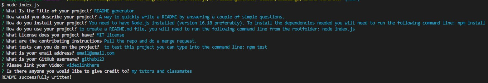

# REDME Generator

  

  ## Table of Contents

  * [Description](#description)
  * [Installation](#installation)
  * [Usage](#usage)
  * [Video](#video)
  * [Screenshots](#screenshots)
  * [Licences](#licences)
  * [Contribution](#contributing)
  * [Tests](#tests)
  * [Credits](#credits)
  * [Questions](#questions)
  
  
  ## Description
  
  A way to quickly write a README by answering a couple of simple questions.

  ## Installation

  You need to have Node.js installed (version 16.18 preferably). To install the dependencies needed you will need to run the following command line: npm install 

  ## Usage

  To create a README.md file, you will need to run the following command line from the rootfolder: node index.js 
  You will then answer each of the prompted questions which will give the information needed for each section of the README.
  When the final question has been answered you will be notified that the file has been created, and will see it appear in the folder.
  You cn then preview the README by right-clicking and selecting 'open preview'.

  ## Video
  https://drive.google.com/file/d/1n7FGLHAQRkE2XMc_WyIa-f2MPGBHphTq/view

  ## Screenshots
  Open the terminal 
   
  Answer the Questions 
   
  This will generate the README 
   
  The preview file of the README 
   

  ## Licences

  This project is using the MIT license

  ## Contributing

  To contribute to this project, you can Pull the repo and do a merge request.

  ## Tests

  To test this project you can type into the command line: npm test

  ## Credits

  I used the information from our previous lessons in class and w3schools for assistance with switch functions  

  ## Questions

  - If you have any questions about the repo, please contact me on: 
  
  - email: <a href="mailto:l.annable@outlook.com">l.annable@outlook.com</a>

  - GitHub: <a href="https://github.com/Leanne-Annable" target="_blank" rel="noopener noreferrer">Leanne-Annable</a>
  
© 2023 edX Boot Camps LLC. Confidential and Proprietary. All Rights Reserved.